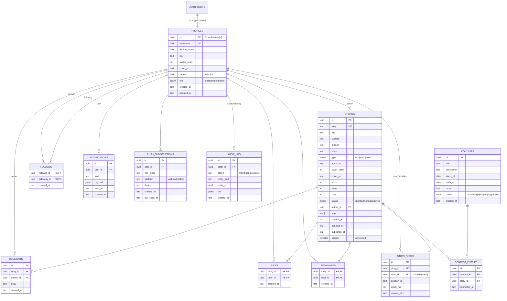

# Siyoh — Data model

A single Postgres database powered by Supabase. Every public-facing table is
RLS-protected; the only paths data can leave the DB are through a query that
the SQL policy explicitly allows.

The schema is **simple by design** — Siyoh is a writing/reading platform,
not a CRM. The recommendation layer is the only place we trade simplicity
for richer signal collection.

---

## Entity-relationship diagram



---

## Tables — column reference

### `profiles`
One row per signed-in user. Created automatically by the
`on_auth_user_created` trigger when `auth.users` gets a new row.

| Column | Type | Notes |
|---|---|---|
| `id` | uuid PK | = `auth.users.id` (cascade on delete) |
| `username` | text UQ | URL slug |
| `display_name` | text | Public name |
| `bio` | text | Markdown not parsed |
| `avatar_seed` | int | 0-4, picks a gradient color set |
| `cover_url` | text? | Optional uploaded cover (Supabase Storage) |
| `locale` | text | `uz` default, also `en`, `ru` |
| `role` | enum | `reader` (default), `writer`, `admin` |

### `stories`
The unit of content. "Books" is a UI filter, not a separate table.

| Column | Type | Notes |
|---|---|---|
| `id` | uuid PK | |
| `slug` | text UQ | URL: `/story/{slug}` |
| `title` / `subtitle` / `excerpt` / `body` | text | Excerpt = first paragraph, 220 chars |
| `type` | enum | `text` / `audio` / `both` |
| `audio_url` | text? | Public URL when type≠text |
| `cover_seed` | int | Gradient fallback when no upload |
| `cover_url` | text? | Uploaded cover image |
| `mins` | int | Computed at publish (words / 220) |
| `plays` | int | Denormalised view counter |
| `likes` | int | Denormalised, maintained by trigger |
| `status` | enum | `draft` / `published` / `archived` |
| `author_id` | uuid FK | Author |
| `tags` | text[] | GIN-indexed for tag filters |
| `published_at` | tstz? | Sort key for the feed |
| `search` | tsvector | Generated column (title A + subtitle B + excerpt C + body D) |

### `comments`
Append-only conversation under a story. Hard-deleted by author or admin.

### `likes` · `bookmarks` · `follows`
Pure join tables; primary key is the composite. Existence = the relation
exists. `follows` adds a check `follower_id <> following_id`.

### `notifications`
Per-user feed item. `kind` is open-ended (`follow`, `like`, `comment`,
`contest`, …). `payload` is JSONB — keys vary by `kind`.

### `push_subscriptions`
One row per (user, device, FCM token). Pruned by the edge function when
FCM returns 404/UNREGISTERED.

### `story_views`
Append-only signal table. `user_id` is nullable so anonymous reads still
contribute to popularity (but not to per-user affinity). The
recommendation MVs read from this.

### `audit_log`
Append-only mutation trail on `stories` and `comments`. `diff` carries
`{ before, after }` (with heavy fields like body redacted).

### `contests` · `contest_entries`
Editorial contests; entries reference stories.

### `auth_users` (managed by Supabase)
GoTrue's users table. Not in our schema; `profiles.id` references it.

---

## Materialised views

### `story_score(story_id, author_id, published_at, tags, score, refreshed_at)`
Global per-story popularity with 14-day half-life on freshness.

```
score = 0.45 · exp(-Δsec / (14 · 86400))
      + 0.30 · ln(1 + plays)
      + 0.25 · ln(1 + likes)
```

Unique index on `story_id` (for `REFRESH CONCURRENTLY`). Refresh hourly via
`pg_cron`.

### `user_tag_affinity(user_id, tag, score, refreshed_at)`
Per-user, per-tag normalised affinity.

```
raw = Σ (views·1 + likes·3 + bookmarks·5)  per tag
score = raw / Σ_user(raw)                  per user, sum-normalised to 1
```

Refresh every 3 hours.

### `recommend_for_user(p_user_id uuid?, p_limit int)`
Returns `setof stories`. Joins:

```
score = story_score.score
      + 1.5 · Σ user_tag_affinity[tags of story]
      + 0.5 · (1 if author followed)
      - 0.8 · (1 if read in last 60 days)
```

Anonymous (`p_user_id IS NULL`) collapses to pure `story_score`.

---

## Row-level security posture

Every public table has RLS **on**. Policies (per entity):

| Entity | Read | Insert | Update | Delete |
|---|---|---|---|---|
| `profiles` | all | (trigger only) | self · admin | (cascade only) |
| `stories` | `published` + own + admin | own (`author_id = auth.uid()`) | own · admin | own · admin |
| `comments` | all | auth | (no update) | own · admin |
| `likes` · `bookmarks` | all | self | — | self |
| `follows` | all | self (`follower_id = auth.uid()`) | — | self |
| `notifications` | self | (trigger / edge fn / self) | self (mark read) | — |
| `push_subscriptions` | self | self | self | self · admin |
| `story_views` | self · admin | anyone | — | — |
| `contests` | all | admin | admin | admin |
| `audit_log` | admin | (trigger only) | — | — |

Helper: `public.is_admin()` returns `true` when the current JWT's profile
has `role = 'admin'`. Used in all admin-only checks; `STABLE` so the
planner inlines it once per query.

---

## Scale notes

Where things bend as you grow.

### < 10k stories, < 50k MAU
- The default indexes are enough. Recommendation MVs refresh in <1 s.
- No partitioning. `story_views` lives as a single table.
- `pg_cron` runs the 2 refresh jobs. Free Supabase tier handles this.

### 10k – 100k stories, 50k – 500k MAU
- `story_views` will be the hot table — keep `(story_id, viewed_at desc)`
  and `(user_id, viewed_at desc) WHERE user_id IS NOT NULL` indexes.
- Move the user-tag-affinity refresh to a Supabase **scheduled function**
  rather than `pg_cron` so the planner can spread the cost.
- Add `user_id` partitioning to `notifications` and `story_views`
  (range on `created_at` by month) once either hits ~30 M rows.
- Consider Supabase Pro PITR.

### 100k+ stories or any virality spike
- Replace `to_tsvector('simple', ...)` in the `search` generated column
  with a custom dictionary (Russian + Uzbek stemming) — same column, just
  drop and recreate.
- Add a read replica via Supabase + route `getStories` reads to it via
  PostgREST's read-only endpoint. Writes stay on primary.
- Recompute `user_tag_affinity` incrementally (only users with new signals
  since last refresh) — cuts MV refresh from O(users·signals) to O(active).
- For collaborative filtering, add **pgvector** + per-story embeddings (a
  cheap nightly job using the OpenAI/HuggingFace embeddings API). The
  recommendation function picks it up additively; no schema break.

---

## N+1 risks to watch

- `getStories` selects `author:profiles!stories_author_id_fkey(*)` to
  pre-join authors in a single round-trip. Don't loop per story.
- `getRecommended` (Phase C) returns base story rows from RPC; the wrapper
  hydrates authors in **one** `IN (…)` query, not one per row.
- `getCommentsForStory` similarly joins comment authors. If a thread gets
  huge (>500 comments), paginate.

---

## Realtime fan-out

We subscribe to **only one** Realtime channel per signed-in tab:
`notifications:user_id=eq.<my-id>`. Connection limits on the free plan are
200 concurrent — well above expected. We do NOT subscribe to
`story.likes` bumps (use the MV refresh tick instead).

---

## Storage

| Bucket | Public read | Write policy |
|---|---|---|
| `covers` | yes | `auth.role() = 'authenticated' AND folder[1] = auth.uid()` |
| `audio` | yes | same |

Cleanup: orphaned objects (a file uploaded then the story never published)
should be GC'd via a daily cron — not implemented yet; see
[BACKEND.md → §13](../BACKEND.md).

---

## See also
- [`SETUP.md`](../SETUP.md) — install + Supabase + Vercel walkthrough
- [`BACKEND.md`](../BACKEND.md) — runtime architecture, JWT, edge functions
- [`supabase/schema.sql`](./schema.sql) — canonical fresh-install schema
- [`supabase/migrations/`](./migrations/) — versioned migrations
